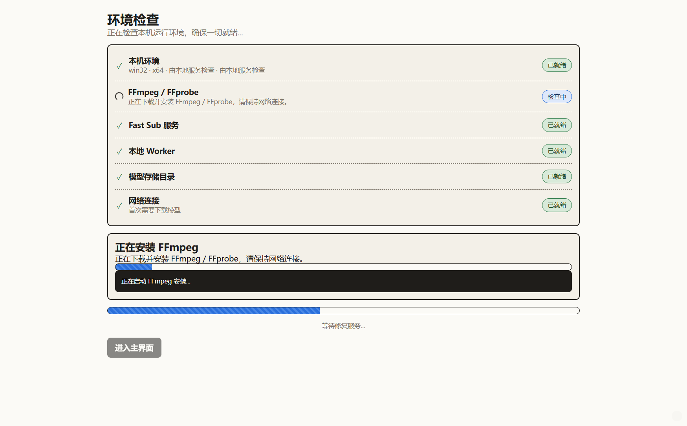
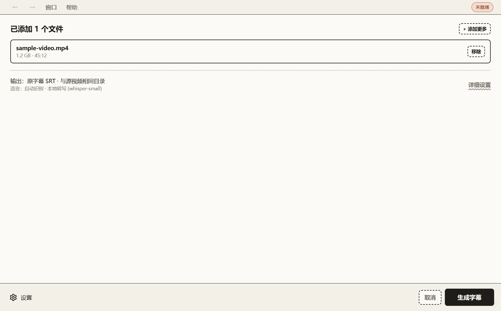
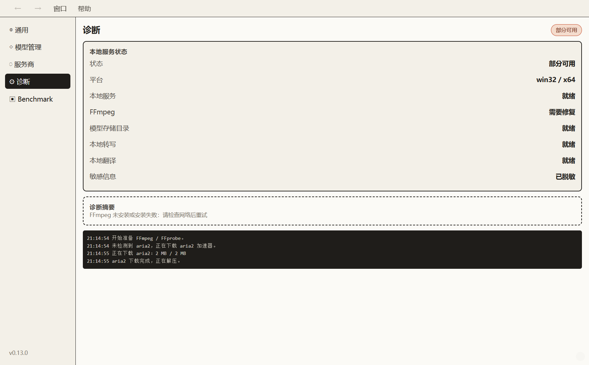

# Fast Sub

Fast Sub is a local-first subtitle tool for video and audio files.

It currently provides:

- A Python v0 CLI for local subtitle generation and translation workflows.
- A Go product core and local daemon for desktop orchestration.
- An Electron desktop app with Windows x64 installer and portable zip release-candidate artifacts.

The project defaults to local processing. Remote API or web providers must be selected explicitly before media or subtitle text is uploaded.

## Current Status

Fast Sub is at the Windows desktop release-candidate stage.

- Windows x64 installer and portable zip have passed Round 13 smoke records.
- macOS arm64 dmg packaging still needs to run on a macOS arm64 release machine.
- Windows builds are currently unsigned internal builds.
- Models are not bundled with the installer; first-start model installation is managed by the app/model store.
- The default local translation model is not bundled and is license-sensitive; the current default NLLB manifest is marked `CC-BY-NC-4.0`.

See [dev-docs/current-status.md](dev-docs/current-status.md) for the current project snapshot.

## Download And Quick Start

Fast Sub is not yet published as a public GitHub Release. The current validated artifacts are Windows x64 release-candidate builds.

| Platform | Status |
| --- | --- |
| Windows x64 installer | Release candidate, unsigned internal build |
| Windows x64 portable zip | Release candidate, unsigned internal build |
| macOS arm64 dmg | Planned, requires macOS arm64 release-machine packaging |
| Linux desktop | Not packaged |

See [help-docs/help/download.md](help-docs/help/download.md) for download status and release limitations.

For source checkout validation:

```powershell
$env:GOCACHE=(Join-Path (Get-Location) '.gocache')
go test ./...
```

```powershell
uv run pytest
```

```powershell
cd desktop
npm run typecheck
npm test
npm run build
```

## Screenshots







## Repository Layout

```text
cmd/                 Go CLI entrypoints
internal/            Go product core, daemon, providers, jobs, models, runtime adapters
src/                 Python CLI, workers, providers, translation, model store, benchmark code
desktop/             Electron desktop app
tests/               Python tests
desktop-tests/       Desktop QA, release smoke records, screenshots, license reports
help-docs/           User help site and GitHub Pages source
dev-docs/            Project plans, architecture, specs, and implementation docs
dev-docs/go-docs/    Go standards and daemon/API specs
dev-docs/ui-docs/    Electron product, architecture, specs, and tracker
local_tests/         Local-only real media/model smoke inputs; do not commit large assets
```

## Development

Python checks:

```powershell
uv run ruff format --check src\fast_sub tests
uv run ruff check src\fast_sub tests
uv run mypy src
uv run pytest
```

Go checks:

```powershell
$env:GOCACHE=(Join-Path (Get-Location) '.gocache')
go test ./...
```

Desktop checks:

```powershell
cd desktop
npm run typecheck
npm test
npm run build
npm run smoke
```

Windows package smoke:

```powershell
cd desktop
npm run package:dir
npm run smoke:packaged
```

## Documentation

- [Live user help](https://ryviuszero.github.io/Fast-Sub/): GitHub Pages help site for normal product usage.
- [help-docs/help/README.md](help-docs/help/README.md): user help and task guides.
- [help-docs/help/download.md](help-docs/help/download.md): download and platform status.
- [help-docs/help/release-notes.md](help-docs/help/release-notes.md): user-facing release status and known limitations.
- [dev-docs/README.md](dev-docs/README.md): documentation map.
- [dev-docs/current-status.md](dev-docs/current-status.md): current status and next work.
- [dev-docs/product/mvp.md](dev-docs/product/mvp.md): v0 MVP summary.
- [dev-docs/go-docs/specs/daemon-api.md](dev-docs/go-docs/specs/daemon-api.md): daemon API contract.
- [dev-docs/api/README.md](dev-docs/api/README.md): generated API/reference documentation policy and index.
- [dev-docs/release/validation.md](dev-docs/release/validation.md): release validation evidence index.
- [dev-docs/ui-docs/project-tracker.md](dev-docs/ui-docs/project-tracker.md): detailed desktop implementation tracker.
- [desktop-tests/round13-release-checklist.md](desktop-tests/round13-release-checklist.md): release checklist.
- [ROADMAP.md](ROADMAP.md): public roadmap.
- [CONTRIBUTING.md](CONTRIBUTING.md): contribution rules.
- [CODE_OF_CONDUCT.md](CODE_OF_CONDUCT.md): community expectations.
- [LICENSE](LICENSE): Fast Sub source license.

## Privacy

Default local providers do not upload media or subtitles. Remote/web/API providers require explicit user selection and confirmation. Renderer code must not receive raw daemon tokens, raw provider secrets, Authorization headers, or raw secret references.

See [help-docs/privacy.md](help-docs/privacy.md).

## License

Fast Sub source code is licensed under the [MIT License](LICENSE).

Third-party dependencies, native runtime downloads, and model artifacts keep their own licenses and distribution policies. See [THIRD_PARTY_NOTICES.md](THIRD_PARTY_NOTICES.md) for details, especially before redistributing packaged binaries or using the default NLLB translation model commercially.
