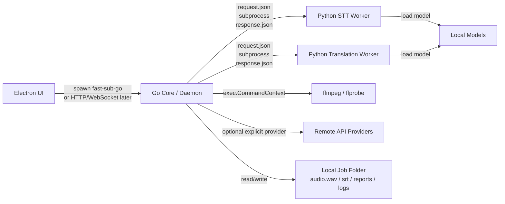
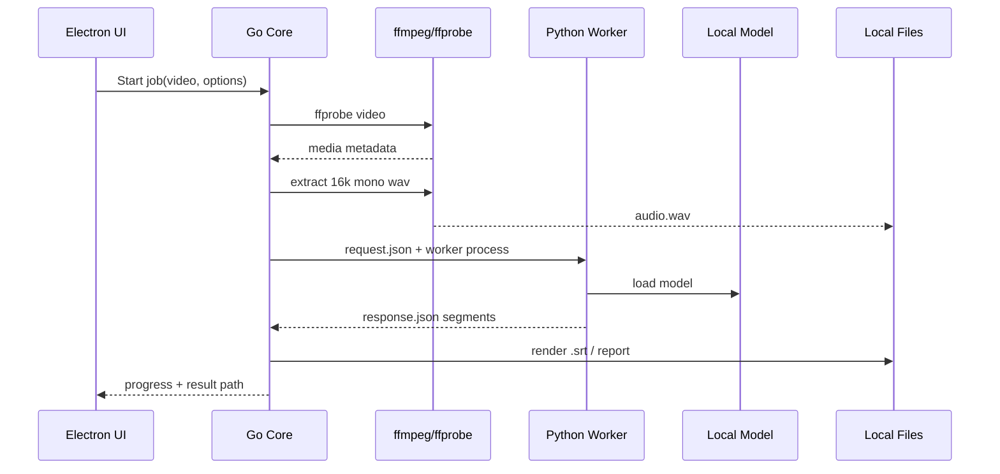

# Fast Sub Go Docs

This directory contains planning and engineering standards for the Go migration.

These documents are intentionally kept separate from the existing Fast Sub planning docs so the Go foundation can evolve without rewriting earlier Python/v0 records.

## Documents

- `project-standards.md`: project-wide standards and code style for the Go migration era, including Python compatibility expectations, Go style, cross-language contracts, and review gates.
- `specs/round8-go-foundation.md`: Round 8 implementation plan for the parallel Go CLI foundation.
- `specs/round9-go-transcribe-auto.md`: Round 9 implementation plan for Go-side transcribe/auto orchestration through Python STT workers.
- `specs/round10-go-product-core.md`: Round 10 product-core plan covering Go model management, provider registry, OpenAI-compatible STT, and native whisper.cpp.

## Target Architecture

Fast Sub 的长期形态是：

```text
Electron UI + Go Core/Daemon + Python Workers + Native Binaries
```

核心分工：

```text
Electron
= 桌面 UI 壳：拖拽、设置、任务列表、进度、日志、结果预览

Go Core
= 产品主体：CLI / daemon / job 调度 / 配置 / 路径 / 下载 / ffmpeg / JSON contract / 日志 / 错误处理

Python
= 模型 worker / AI adapter：faster-whisper、NLLB、OpenAI-compatible adapter、web translate adapter

Native binaries
= ffmpeg / ffprobe / 后续 whisper.cpp / ONNX / TensorRT 等
```

整体关系：



## Process Model

最终桌面版常态进程：

```text
Electron main process
Go daemon process
```

执行一个字幕任务时，Go daemon 会临时启动子进程：

```text
Electron
Go daemon
ffprobe
ffmpeg
Python faster-whisper worker
```

执行翻译任务时可能启动：

```text
Electron
Go daemon
Python NLLB worker
```

或者在用户显式选择远程 provider 时：

```text
Electron
Go daemon
remote API request
```

推荐原则：

- Electron 不直接调用 Python worker。
- 重模型 Python worker 使用 adaptive warm worker 策略：按任务启动，批量/队列场景复用，空闲超时后退出。
- 轻量 API/web adapter 可以继续使用 one-shot 或 Go 内部调用。
- Go daemon 常驻并拥有任务调度、取消、进度、日志、路径和错误处理。
- ffmpeg / ffprobe 始终作为临时子进程运行。
- 后续如果批量任务仍受模型加载或进程启动影响，再考虑完整 Python worker pool。

## Communication

### Electron UI <-> Go Core

早期最稳的通信方式：

```text
Electron spawn fast-sub-go CLI
```

方式：

- Electron 使用 Node `child_process.spawn()` 启动 `fast-sub-go`。
- Go `stdout` 输出 JSON 结果。
- Go `stderr` 输出进度、warning、debug log。
- Electron 根据 exit code 判断成功/失败。

后续桌面产品更适合：

```text
Electron <-> Go local daemon
```

推荐协议：

- HTTP：创建任务、查询任务、取消任务、读取结果。
- WebSocket 或 SSE：推送进度、日志和状态变化。

演进路径：

```text
Round 8/9: Electron or tests spawn Go CLI
Later desktop: Electron starts Go daemon and talks through HTTP/WebSocket
```

### Go Core <-> Python Worker

推荐使用文件协议 + 子进程：

```text
1. Go 创建 job folder
2. Go 写 request.json
3. Go 启动 Python worker 进程
4. Python 读取 request.json
5. Python 执行模型推理或 AI adapter
6. Python 写 response.json.tmp
7. Python rename 为 response.json
8. Go 等 worker 退出
9. Go 读取并校验 response.json
```

Worker 生命周期策略：

Fast Sub 默认采用 adaptive warm worker，而不是永久常驻或每次都冷启动。

```text
worker_mode = auto | one-shot | warm
default = auto
```

规则：

- `auto`: Go 根据任务类型和队列判断是否保温 worker。
- `one-shot`: 每个任务启动一个 Python worker，用完退出，适合调试、低资源机器或用户明确不想占用显存。
- `warm`: worker 处理完任务后保持 idle，等待后续同模型任务，适合目录批处理。
- 重模型 worker 包括 ASR worker 和本地 NLLB/CTranslate2 translation worker。
- API/web translation adapter 默认不需要 warm worker。

Adaptive warm worker 行为：

```text
1. 任务到达。
2. Go 按 worker key 查找可复用 worker。
3. 没有可复用 worker 时启动 Python worker。
4. worker 加载模型并处理任务。
5. 任务结束后进入 idle。
6. idle_timeout 内有同 key 任务到达则复用。
7. idle_timeout 到期且资源压力允许退出时，graceful shutdown。
8. worker 卡死、崩溃或被 hard kill 后标记 dirty，不再复用。
```

Worker key：

```text
worker_type + provider/backend + model_path/model_id + device + compute_type
```

示例：

```text
asr:faster-whisper-small:cuda:float16
translate:nllb-200-distilled-600m-ct2-int8:cpu:int8
```

默认 idle timeout：

```text
asr_worker_idle_timeout = 300s
translation_worker_idle_timeout = 300s
```

后续 CLI/config 可以暴露：

```text
--worker-mode auto|one-shot|warm
--worker-idle-timeout <seconds>
```

Warm worker transport：

- one-shot/debug fallback 可以继续使用 file JSON。
- warm worker 建议使用 stdio NDJSON-RPC。
- stdin: Go -> Python request。
- stdout: Python -> Go protocol event/result。
- stderr: Python human/debug logs。
- 每条 protocol message 一行 JSON。
- 每个 request 必须有 id。
- 支持 `capabilities`、`load_model`、`transcribe`、`translate`、`cancel`、`health`、`shutdown`。

Worker state：

```text
starting
ready
loading_model
model_loaded
busy
idle
draining
stopping
stopped
failed
```

Local resource check：

- Go 在启动 warm worker 前应检查本地资源是否足够。
- 最小检查：
  - 可用内存。
  - 可用磁盘空间。
  - GPU 是否可用，若可检测。
  - 当前是否已有同类重模型 worker。
- 资源不足时优先选择 one-shot 或及时释放 idle worker。
- ASR worker 可能占用 GPU/内存并影响后续 translation worker；调度器需要在本地 NLLB translation 前释放不再需要的 ASR idle worker。
- 用户机器性能一般时，`auto` 模式应更保守：降低并发、缩短 idle timeout、避免同时保温 ASR 和 NLLB worker。

Worker discovery 顺序：

```text
1. 显式 CLI 参数，例如 --worker-command
2. 配置文件中的 worker_command
3. 环境变量，例如 FAST_SUB_STT_WORKER_COMMAND
4. PATH 中的 fast-sub-worker-* 可执行文件
5. 桌面打包版本内置的 bundled worker
6. 清晰 missing_worker structured error
```

Worker capabilities / handshake：

- Go 可以在运行任务前调用 worker capability 命令，或读取 worker capability response。
- capability 用于判断协议版本、worker 类型、支持特性和模型 backend 是否兼容。
- 不兼容时应在模型加载和长任务开始前失败。

示例：

```json
{
  "schema_version": "worker_capabilities_v1",
  "worker_type": "stt",
  "protocol_versions": ["stt_worker_request_v1"],
  "features": ["language_auto_detect", "word_timestamps"],
  "backends": ["faster-whisper", "whisperx"]
}
```

示例命令：

```bash
fast-sub-worker-faster-whisper \
  --request C:/jobs/123/request.json \
  --response C:/jobs/123/response.json
```

STT request 示例：

```json
{
  "schema_version": "stt_worker_request_v1",
  "job_id": "job_123",
  "audio_path": "C:/jobs/123/audio.wav",
  "model_path": "C:/FastSub/models/whisper-small",
  "language": "auto",
  "device": "auto",
  "compute_type": "auto",
  "batch_size": 8
}
```

STT success response 示例：

```json
{
  "schema_version": "stt_worker_response_v1",
  "ok": true,
  "language": "zh",
  "segments": [
    {
      "start_sec": 0.0,
      "end_sec": 2.5,
      "text": "你好，欢迎使用 Fast Sub。"
    }
  ],
  "warnings": []
}
```

Worker failure response 示例：

```json
{
  "schema_version": "stt_worker_response_v1",
  "ok": false,
  "error": {
    "code": "missing_model",
    "message": "Model path does not exist.",
    "retryable": false
  }
}
```

Worker 进程控制：

- Go 为每个 worker 调用设置 timeout/cancel context。
- 用户取消任务时，Go 负责终止 worker 进程并清理未完成的临时输出。
- Go 捕获 worker stderr tail，用于 structured error diagnostics，但不得泄露 secret。
- response JSON 必须包含 `schema_version` 和 `job_id` 或等价 request correlation id。
- response JSON 缺失、schema mismatch、非法 JSON、worker 非零退出都由 Go 转换为 structured error。
- worker 正常响应 cancel 时可以写 canceled response；worker 被强杀时由 Go 生成 `worker_canceled` 或 `worker_timeout` error。
- 用户取消不等同普通失败，job status 应记录为 `canceled`。

Progress 文件：

- 即使第一版不做实时 streaming，也应预留 `progress.json` 或 progress events schema。
- 推荐阶段：

```text
probing_media
extracting_audio
loading_model
transcribing
aligning
translating
rendering
done
```

- UI/daemon 阶段可以从同一 progress schema 演进为 SSE/WebSocket events。

约束：

- Worker stdout 保留，默认应为空。
- Worker stderr 只写人类可读日志。
- 结构化结果只写 response JSON。
- response 写入必须尽量 atomic：先写 `.tmp`，再 rename。
- Python worker 不读取主配置。
- Python worker 不下载模型。
- Python worker 不决定最终输出路径。
- Python worker 不直接写最终 SRT/ASS/MP4。

### Go Core <-> ffmpeg / ffprobe

Go 使用：

```text
exec.CommandContext
```

规则：

- 不使用 CGo ffmpeg bindings。
- ffprobe stdout 用于结构化 metadata。
- ffmpeg stderr 用于进度/错误诊断。
- Go 负责 timeout、取消、stderr tail、exit code 转换。
- Windows path 必须通过 `filepath` 和参数数组处理，不手写 shell command string。
- ffprobe 推荐输出 JSON writer，例如 `-v error -print_format json -show_format -show_streams <input>`。
- ffmpeg/extract 输出应先写同目录临时文件，成功后 rename 到最终路径；失败、取消或 timeout 时清理临时文件。
- Round 8 只实现低风险 CLI preview，不实现正式 job folder、daemon job lifecycle 或 progress API。

## Job Folder And Resource Control

即使 Round 8 不实现正式 job system，长期设计中每个任务都应拥有独立 job folder：

```text
jobs/
  job_001/
    job.json
    request.json
    response.json
    progress.json
    logs/
      worker.stderr.log
      ffmpeg.stderr.log
    outputs/
```

Job status：

```text
created
queued
running
succeeded
failed
canceling
canceled
```

Job 生命周期策略：

- 成功任务默认可以清理中间音频和临时文件，只保留最终输出和 report。
- 失败任务默认保留 request、response/error、stderr tail 和必要临时文件，便于诊断。
- 提供 `--keep-temp` 或等价配置保留中间文件。
- 需要有磁盘空间不足、权限不足和输出目录不可写的 structured error。
- 后续桌面版需要可配置 retention policy。

资源锁和并发限制：

```text
ffmpeg_concurrency
gpu_asr_lock
cpu_heavy_lock
model_install_lock
provider_rate_limit_lock
warm_worker_memory_budget
warm_worker_vram_budget
```

原则：

- 同一 GPU 上默认只运行一个重 ASR 任务，避免 OOM。
- 默认不同时保温多个占用大量内存/显存的模型 worker，除非本地资源检查确认充足。
- 当 ASR 阶段完成且后续需要本地翻译时，可以提前释放 ASR idle worker，为 NLLB worker 腾出资源。
- 模型安装必须按 model id 加锁，避免并发下载破坏模型目录。
- 远程 provider 需要 rate-limit aware 调度。
- 批量任务优先通过资源锁提升稳定性，而不是过早引入外部消息队列。

## Subtitle Job Flow



## Ownership Rules

- UI 只负责体验，不拥有字幕业务逻辑。
- Go 拥有任务、配置、路径、进度、取消、日志、错误、文件输出和 provider orchestration。
- Python 拥有模型生态适配和推理，不拥有主业务流程。
- Native binaries 只做高性能媒体或模型后端能力。
- Remote API provider 必须显式启用，不能被默认路径静默触发。
